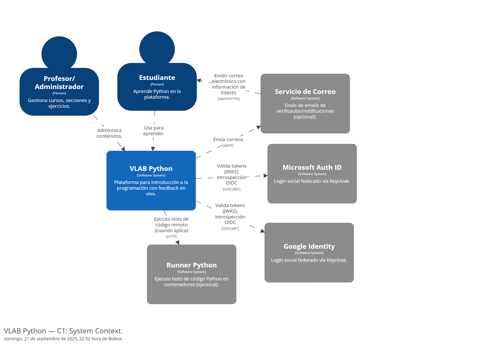
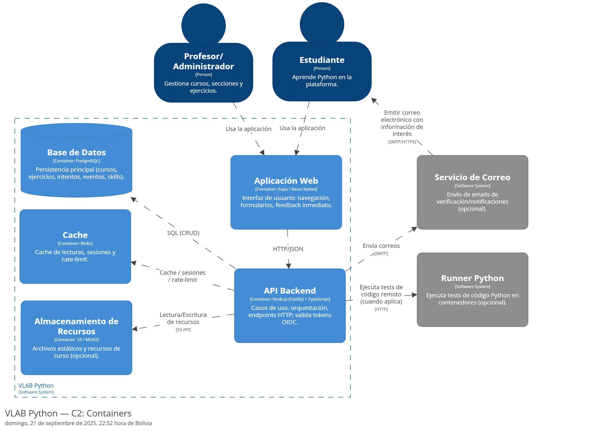
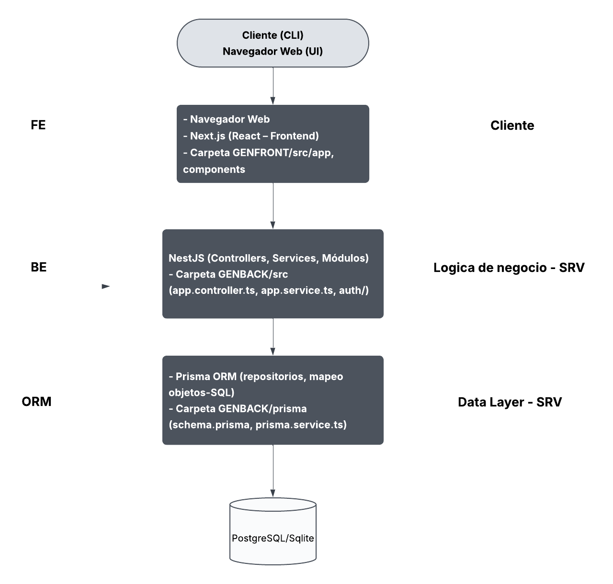
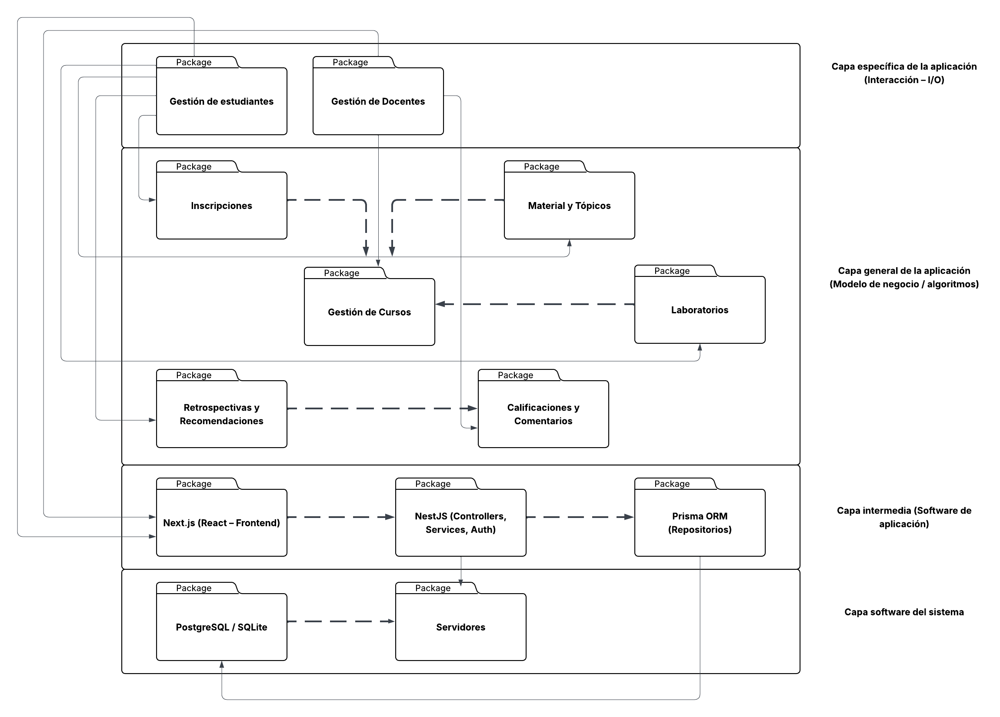

# Pyson

Proyecto para la creación de cursos de introducción a la programación orientados al manejo de Python

## Comenzando

Primero, ejecuta el servidor de desarrollo:

```bash
npm run dev
# o
yarn dev
# o
pnpm dev
# o
bun dev
```

Abre [http://localhost:3000](http://localhost:3000) en tu navegador para ver el resultado.

Puedes comenzar a editar la página modificando los archivos del proyecto. La página se actualiza automáticamente mientras editas.

***
<br>
<br>

<h1 style="border-bottom: none;">Arquitectura del Software</h1>

Este proyecto incluye diagramas en notación C4, modelados con **Structurizr DSL**

<h2 style="border-bottom: none;">C1 - Contexto del Sistema</h2>

El diagrama C1 muestra a los actores externos (estudiantes, profesores) y los sistemas con los que interactúa el VLAB Python.

<div align="center">
    
</div>

<h2 style="border-bottom: none;">C2 - Contenedores</h2>

El diagrama C2 descompone el sistema principal en contenedores (Aplicación Web, API Backend, Base de Datos, etc.) y muestra sus relaciones.

<div align="center">
    
</div>

***

<h2 style="border-bottom: none;">Fuente de los diagramas</h2>

- Código DSL: docs/structrizr/workspace.dsl'

<p style="color:#a7a7a7">
    <i>Los diagramas pueden ser editados con la herramienta online de Structurizr:</i> https://structurizr.com/dsl
</p>

***
<br>
<br>

<h1 style="border-bottom: none;">Arquitectura de Capas</h1>

Este proyecto incluye diagramas de **arquitectura por capas**, modelados con notación de **Lucidchart**. 

<h2 style="border-bottom: none;">Arquitectura por Capas Tecnologicas</h2>

<p align="justify">
Este modelo organiza el sistema desde el punto de vista de las tecnologias utilizadas. La capa de Frontend (Next.js/React) se encarga de la interaccion con el usuario. La capa de Backend 
(NestJS) implementa la logica de negocio mediante controladores, servicios y modulos. La capa de ORM (Prisma) gestiona el acceso a datos y el mapeo de entidades. Finalmente, la Base de Datos (Sqlite/Postgrestsql) asegura el almacenamiento persistente.
</p>

<div align="center">
    
</div>

<h2 style="border-bottom: none;">Arquitectura por Capas Funcionales</h2>

<p align="justify">
Este modelo representa el sistema desde el enfoque funcional y de negocio. En la capa de interaccion, se gestionan estudiantes y docentes. La capa de negocio incluye procesos clave como inscripciones, cursos, materiales, laboratorios, retroalimentaciones y calificaciones. La capa intermedia muestra las tecnologías que soportan el flujo (Next.js, NestJS y Prisma ORM). Por ultimo, la capa de sistema se apoya en los servidores y la base de datos que sostienen toda la aplicación.
</p>

<div align="center">
    
</div>

***

<h2 style="border-bottom: none;">Funente de los Diagramas</h2>

<p style="color:#a7a7a7">
<i>Los diagramas puedes se editados utlizando la herramienta online de </i> https://www.lucidchart.com/pages
</p>

***
<br>
<br>

<h1 style="border-bottom: none;">Pilares de calidad del sistema</h1>

<h2 style="border-bottom: none;">1. Seguridad</h2>

Manejar datos de estudiantes, calificaciones y comentarios.
Acciones clave:

 <h4>AuthN / AuthZ (Autenticacion y Autorizacion)</h4>
  <ul>
    <li>Usa OAuth 2.0 / OpenID Connect con Google y Microsoft para el registro/login.</li>
    <li>Implementa RBAC (Role-Based Access Control): roles Docente y Estudiante, con permisos diferenciados por curso y modulo.</li>
    <li>Verifica access/ID tokens en el backend (NestJS) usando librerias oficiales de Google/Microsoft. </li>
  </ul>

  <h4>Gestion de credenciales</h4>
  <ul>
    <li>No almacenes tokens sensibles en el cliente.</li>
    <li>Maneja refresh tokens y la caducidad de sesiones de forma segura.</li>
  </ul>

  <h4>Cifrado y protección de datos</h4>
  <ul>
    <li>Cifrado en transitoo (TLS/HTTPS) y en reposo .</li>
  </ul>

  <h4>Auditoría y cumplimiento</h4>
  <ul>
    <li>Registra quien califica, editao accedea datos.</li>
    <li>Manten logs de seguridad.</li>
    </li>
  </ul>
</section>

<h2 style="border-bottom: none;">2. Integridad</h2>

 Evaluaciones, progreso y calificaciones no pueden perderse ni duplicarse.

 <h4>Acciones clave</h4>
<ul>
  <li>Usar transacciones en inscripciones, envios y calificaciones; aplicar operaciones idempotentes.</li>
  <li>Implementar backups y restauracion probada; mantener versiones de contenido (historial de edicion).</li>
</ul>

<h4>Indicadores</h4>
<ul>
  <li>Disponibilidad.</li>
  <li>Tasa de errores en envios.</li>
  <li>Numero de reintentos exitosos.</li>
  <li>RPO/RTO definidos y medidos.</li>
</ul>
</section>

<h2 style="border-bottom: none;">3. Escalabilidad</h2>

Picos en entregas y horas de clase.

<h4>Acciones clave</h4>
<ul>
  <li>CDN para contenido estatico, cache de paginas/materiales, paginacion en listados.</li>
  <li>Jobs asincronos para transcribir videos, generar previews de slides, recomputar recomendaciones.</li>
  <li>Carga diferida (lazy load) de medios; compresion y streaming adaptativo.</li>
  <li>Observabilidad basica: metricas (p95 latencia), logs estructurados y trazas.</li>
</ul>

<h4>Indicadores</h4>
<ul>
  <li>p95 de latencia por endpoint.</li>
  <li>TTFB.</li>
  <li>Tasa de cache hit.</li>
  <li>Coste por usuario.</li>
</ul>

<h2 style="border-bottom: none;">4. Testeabilidad</h2>

El dominio crece (modulos, topicos, labs, hints, recomendaciones). 
Mantener velocidad sin romper.

<h4>Acciones clave</h4>
<ul>
  <li>Arquitectura modular (Curso, Modulo, Topico, Laboratorio, Inscripcion, Calificacion) con servicios y repositorios claros.</li>
  <li>Piramide de tests: unitarios (dominio), de integracion (repos/colas), E2E (flujos: inscribir -> ver material -> enviar -> calificar).</li>
  <li>Seeds/fixtures para escenarios reales (docente/estudiante, curso sin-inscripcion).</li>
  <li>CI con coverage gate y lint; feature flags para cambios de UX.</li>
</ul>

<h4>Indicadores</h4>
<ul>
  <li>Cobertura >80% en dominio.</li>
  <li>Tiempo de build.</li>
  <li>Lead time.</li>
  <li>Tasa de regresiones.</li>
</ul>

<h2 style="border-bottom: none;">5. Accesibilidad</h2>

<p>Debe ser usable para todos los estudiantes y docentes.</p>

<h4>Acciones clave</h4>
<ul>
  <li>Cumplir con las pautas WCAG 2.2 nivel AA: contraste suficiente, foco visible, navegacion completa con teclado.</li>
  <li>Usar componentes accesibles para la inscripcion, modales de retroalimentacion y tablas de calificaciones.</li>
</ul>

<h4>Indicadores</h4>
<ul>
  <li>Porcentaje de pantallas auditadas con conformidad AA.</li>
  <li>Numero de errores de accesibilidad por pagina.</li>
  <li>Tasa de finalizacion de tareas usando solo teclado.</li>
</ul>
